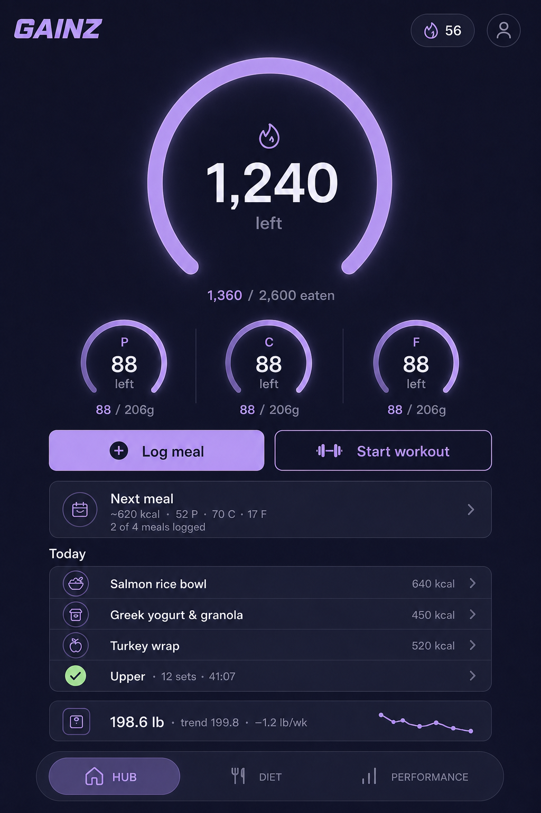
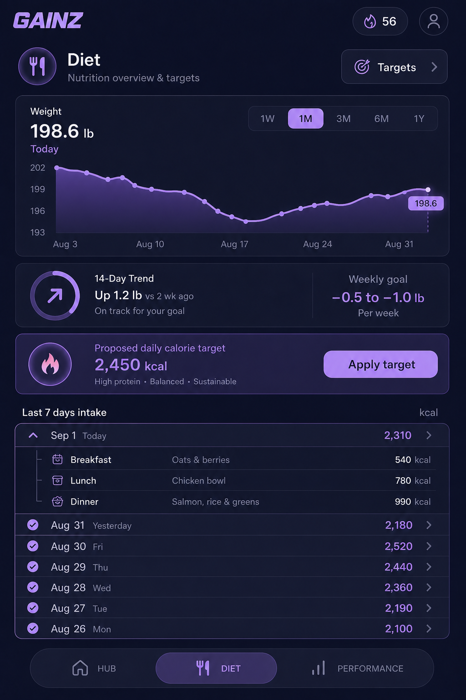
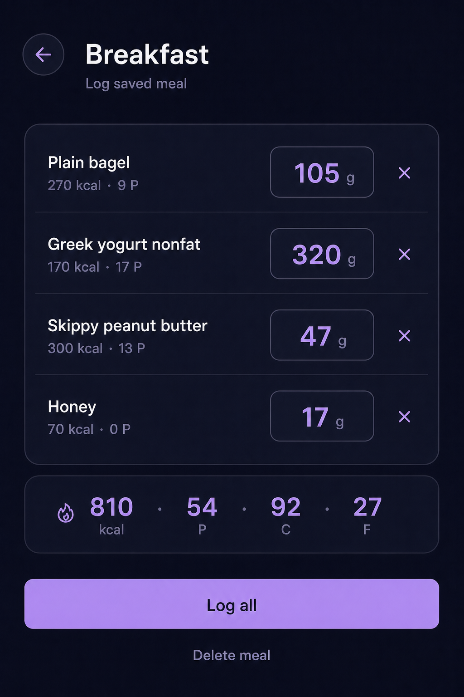
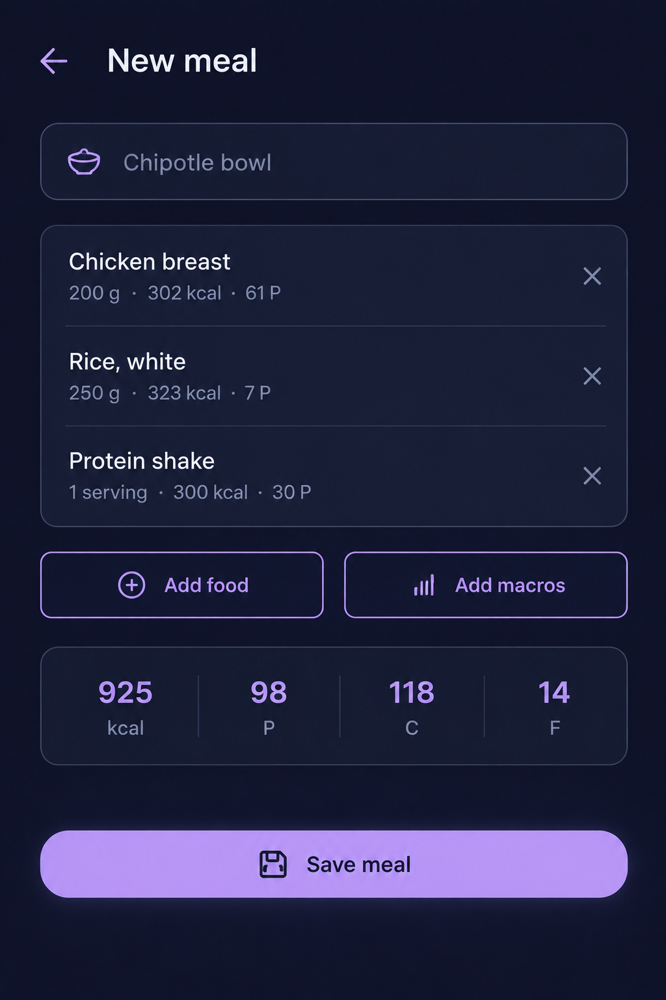
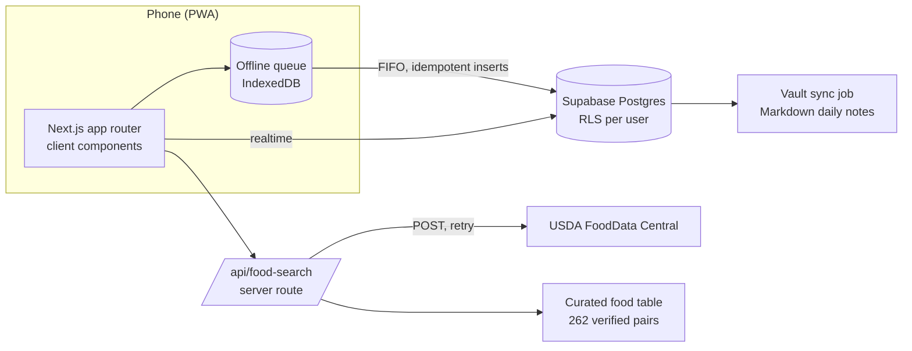

<div align="center">

# Gainz

**A mobile-first macro & training tracker that makes logging fast enough to actually do every day.**

Next.js 16 · TypeScript · Supabase · Tailwind v4 · Offline-first PWA

[**Live app**](https://gainz-app-phi.vercel.app) · [Design specs](docs/superpowers/specs) · [Implementation plans](docs/superpowers/plans)

    

</div>

---

## Why this exists

Every macro tracker I tried failed the same way: logging a meal took ten taps and a fight with a search box, so I stopped logging. Gainz is built around one rule: **the common case is one tap.** Search returns real foods with verified numbers, saved meals log in a single tap, and the app still works when the gym has no signal.

It is a personal tool first (one user, real data, daily use through a 15-week cut), built with the same rigor as production software: written specs, designed screens, a test suite, and reviewed pull-request-style changes.

## Screens

Design candidates are generated as images, one is chosen, and the screen is implemented from the render. Left to right: home, log meal, saved-meal review, meal builder.

| Home | Log meal | Saved meal | Meal builder |
|:---:|:---:|:---:|:---:|
|  |  |  |  |

<!-- Phone screenshots go in docs/readme/{hub,log-meal,saved-meal,performance}.png; swap this table for them when available. -->

## Features

**Nutrition**
- **Food search that returns foods, not noise.** A curated table of 262 everyday foods, each mapped to a verified USDA record for the food as eaten and, where weighing matters, the same food raw or dry. Live USDA search fills in behind it.
- **Raw ⇄ Cooked switch.** Weigh chicken before or after cooking; the numbers follow. Grains switch between dry and cooked.
- **Saved meals.** Save today's meals under a name, or build one from scratch from searched foods and hand-entered macro lines. Log the whole thing in one tap, adjusting grams or servings on the way.
- **Macro targets from a formula, not a guess.** Mifflin-St Jeor TDEE, phase-aware protein and fat floors, carbs fill the remainder, recalculated as body weight moves.

**Body weight**
- Daily weigh-in with an exponential-moving-average trend line that filters day-to-day water noise.
- 14-day slope with a stall detector that suggests a bounded calorie adjustment (never applied automatically).

**Training**
- Workout flow: pick muscle groups → exercise library of ~150 movements → log sets with scroll-wheel pickers, with "last time" shown per exercise.
- Performance tab: indicator lifts against protocol baselines, top-set progression charts, and a Strength Index that normalizes every lift to its own first session so a cut's strength loss is visible early.

**Platform**
- **Offline-first.** Every write goes through an IndexedDB queue with strict FIFO and idempotent inserts; it drains when the network returns. Log a meal in a basement gym and it lands later.
- Installable PWA, single-hand layout, dark lavender theme driven entirely by design tokens.

## Architecture



- **`app/`** — routes: HUB `/`, `/diet`, `/performance`, `/log/meal` (+ `/new`, `/pattern/[id]`), `/workout/new`, `/workout/[id]`, `/profile`, and the USDA proxy at `/api/food-search`.
- **`lib/`** — pure, unit-tested domain logic: `targets` (macro math), `trend` (EMA + OLS stall detection), `progress` (Epley top-set estimates, Strength Index), `patterns` (saved-meal scaling), `foods` (curated search and ranking), `queue` (offline queue contract). Data access lives in thin `*-db.ts` modules.
- **`components/`** — token-styled UI: gauges, charts, bottom sheets, the reusable `FoodPicker`.
- **`supabase/schema.sql`** — append-only migration log with row-level security on every table.

### The food data problem

USDA's database has 400k rows and a search API that returns "Chicken, back, raw" and "Chicken cornbread" for the word *chicken*. The fix was a curated core table: 262 foods a person actually logs, each with a human name, search aliases, and a verified USDA id for the cooked and raw states of the **same** food (same cut, same lean percentage, same species). The table was built and then **independently verified**: every one of 367 USDA ids was re-fetched and diffed against the stored macros, and a second pass judged each raw/cooked pair for sameness. Invariants are enforced by tests (no duplicate ids, plausible densities, raw meat never denser than cooked, dry grains always denser, and every alias resolving to its own food).

## Engineering process

Each sub-project follows the same loop, and the artifacts are in the repo:

1. **Spec** — a short design document with the data model, pure-logic contracts and reference test cases (`docs/superpowers/specs/`).
2. **Design** — screens are explored as image candidates, one is chosen, and the implementation is done *from* the render rather than re-derived in code (`docs/superpowers/design/`).
3. **Plan** — bite-sized tasks with the exact code and tests (`docs/superpowers/plans/`).
4. **Build with review** — each task is implemented, then reviewed for spec compliance and code quality, then a whole-branch review before it ships. Findings are fixed or explicitly parked with a written ruling.

Result so far: 146 unit tests across 11 files, typed end to end, zero hex colours outside the token sheet.

## Running locally

```bash
git clone https://github.com/GeorgeManavazian/gainz-app
cd gainz-app && npm install
cp .env.example .env.local   # Supabase URL + anon key, USDA API key
npm run dev
```

Apply `supabase/schema.sql` to a Supabase project (blocks are append-only; paste new blocks in order). Get a free USDA key at api.data.gov.

```bash
npm test          # vitest
npx tsc --noEmit  # typecheck
npm run build
```

## Roadmap

Shipped: macro targets → weigh-ins and stall detection → workout flow → HUB / Diet / Performance tabs → curated food search → saved meals → meal builder.

Next:
- **Next-meal advice** — the HUB card becomes real: remaining budget split across meals left, time-aware.
- **Adaptive TDEE** — back-solve maintenance calories from logged intake versus the weight trend, replacing the formula estimate with measured reality.
- **Wearable integration** — daily activity adjusts the calorie budget.
- **Lift PRs and progression** — per-exercise records and suggested loads.
- **Multi-user** — the schema is already per-user with RLS; a public release needs onboarding and a service worker for cold-start offline.

The end goal is a tracker that closes the loop on its own: it knows what you ate, what you weigh, and how you trained, and tells you the one number that matters next.

## Author

Built by [George Manavazian](https://github.com/GeorgeManavazian). Questions and ideas welcome via issues.

## License

MIT
